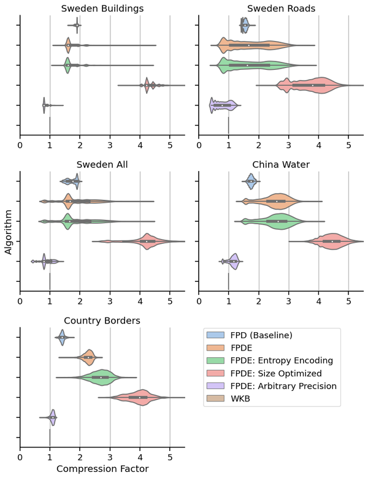
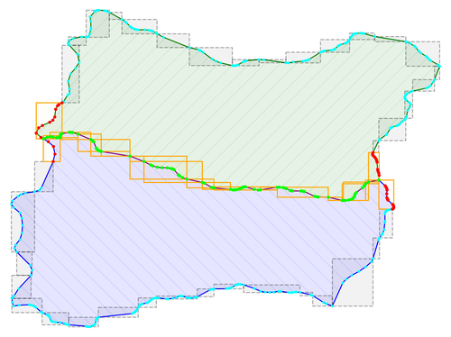
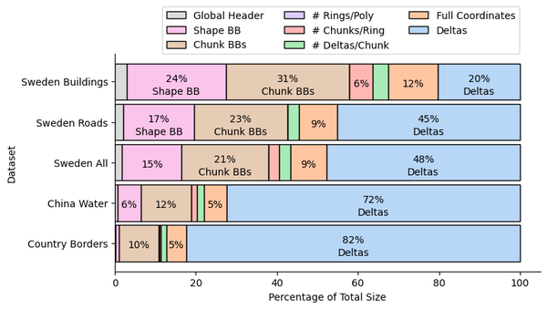

# Compression Algorithms for Geometries Supporting Operations

Master's thesis by **Simon Erlandsson** and **Leo Westerberg**, carried out at **AFRY AB** in close collaboration with one of the world's leading maps providers, and the Department of Computer Science, LTH | Lund University (2023).

Maps services store vast amounts of geometric data to represent structures of the world such as roads, buildings, and borders. With increasing data volumes, storage and transmission requirements grow. Conventional compression algorithms can reduce size but require full decompression before any operation can be performed, adding overhead that may exceed the cost of the operation itself. When performing large volumes of operations, such as validating map fragments, this overhead becomes significant.

This project proposes **Floating-Point Delta Extended (FPDE)**, a compression format for map geometries that supports **partial decompression**. Coordinates are delta-encoded using 32-bit integer decomposed coordinates, divided into independently decodable **chunks**, and optionally entropy-coded with Huffman encoding. Each chunk stores its own bounding box, enabling operations like intersection to skip irrelevant sections entirely.

**Key results:** 2.56x average compression factor over WKB, and 3.6x average speedup for intersection on large geometries compared to full decompression.

### Algorithm Variants

The compression factor plot below compares the following configurations across five datasets:

| Variant | Description |
|---------|-------------|
| **WKB** | Well-Known Binary — the industry-standard uncompressed baseline |
| **FPD** (Baseline) | Floating-point delta encoding (64-bit IEEE 754), no operation support |
| **FPDE** | Extended FPD with 32-bit integer decomposed coordinates, chunk metadata, and bounding boxes for efficient operations |
| **FPDE: Entropy Encoding** | FPDE with per-geometry Huffman or Golomb-Rice entropy coding on the deltas |
| **FPDE: Size Optimized** | FPDE without operation metadata or chunk limits — maximum compression, no random access |
| **FPDE: Arbitrary Precision** | FPDE using 64-bit IEEE 754 floats instead of 32-bit integer decomposed coordinates |



*Compression factor relative to WKB across datasets (higher is better). FPDE: Size Optimized achieves the best compression, while FPDE with entropy encoding provides the best trade-off between size and operability.*

### Chunk-Based Intersection

The key advantage of FPDE is that operations can work on a subset of the compressed data. For intersection, each geometry is divided into chunks with precomputed bounding boxes. Only chunks whose bounding boxes overlap with chunks of the other geometry are decompressed — the rest are skipped entirely.



*Chunk-based intersection on two administrative borders. The two polygon boundaries are shown in dark blue/cyan and dark green/cyan. Dashed gray rectangles are the per-chunk bounding boxes. Orange rectangles highlight chunk pairs with overlapping bounding boxes that are actually decompressed. Green vertices contribute to the intersecting shape, red vertices were decompressed but not needed, and cyan sections were skipped entirely.*

### Format Overhead

The FPDE format adds metadata (global header, shape bounding box, chunk bounding boxes, ring/polygon/chunk counts) on top of the actual coordinate data (full reset coordinates and deltas). The chart below shows how the total compressed size is distributed across these components for each dataset. For geometries with many vertices (e.g. China Water, Country Borders), deltas dominate and overhead is small. For smaller geometries (e.g. Sweden Buildings), the bounding-box and header metadata takes up a larger share.



*Breakdown of compressed size by component for each dataset. Deltas make up the bulk of the data for large geometries, while metadata overhead is more prominent for datasets with many small shapes.*

## Reports

- [Final Report (PDF)](docs/Final%20Report.pdf) — Full thesis ([also available on LUP](https://lup.lub.lu.se/student-papers/search/publication/9138526))
- [Presentation (PDF)](docs/Presentation.pdf) — Thesis defense slides

The report covers additional topics beyond this README, including:
- Theoretical background on delta encoding, zigzag encoding, entropy coding (Huffman, Golomb-Rice), and spatial indexing with quadtrees
- Detailed analysis of the chunk size-time trade-off and its impact on both compression ratio and intersection speed
- Evaluation of different floating-point representations: IEEE 754, variable precision floats, and 32-bit integer decomposed coordinates
- Discussion of dataset properties and how geometry complexity (vertex count, shape type) affects compression and operation performance
- Correctness validation methodology and comparison against Shapely as a reference implementation
- Future work directions such as implementation in a high-performance language, parallelization, and further reduction of inter-object redundancies

## Notebooks

The notebooks are the main entry point for running experiments. They import the algorithm implementations from `algos/`, load datasets from `data/`, and use shared utilities from `bench_utils.py` and `var_float.py`. To reproduce results, open and run the notebooks in order — starting with `Dataset_Preprocessing.ipynb` to prepare the data, then any of the analysis or benchmarking notebooks.

| Area | Notebook | Description |
|------|----------|-------------|
| Data | `Dataset_Preprocessing.ipynb` | Loads and preprocesses raw geometry datasets into a common format |
| Compression | `Delta_Analysis.ipynb` | Analyzes delta-encoded coordinate distributions and optimal bit-widths |
| | `VarFloat_Error_Visualization.ipynb` | Visualizes precision errors introduced by variable-precision floats |
| | `Entropy_Sketching.ipynb` | Builds and evaluates Huffman entropy models for delta values |
| | `Predictor_Function_Exporter.ipynb` | Trains and exports predictor functions for predictive delta encoding |
| | `FPDE_Analysis.ipynb` | Analysis of the extended FPD (Fixed-Precision Delta) compression format |
| | `Compression_Alternatives_Statistics.ipynb` | Compares compression factors across algorithm variants and datasets |
| Benchmarking | `TestBench.ipynb` | Runs the full compression/decompression benchmark suite |
| | `TestBench_Results_Visualization.ipynb` | Visualizes and compares TestBench output across algorithms |
| Operations | `Operations_Statistics.ipynb` | Benchmarks unary operations (vertex count, bounding box, type) on compressed geometries |
| | `Spatial_Indexing.ipynb` | Experiments with spatial indexing structures (quadtrees) on compressed data |
| Intersection | `Intersection_Data_Collector.ipynb` | Generates intersection test-case pairs from real-world datasets |
| | `Intersection_Validation.ipynb` | Validates correctness of the chunk-based intersection algorithm |
| | `Intersection_Statistics.ipynb` | Benchmarks intersection performance: partial vs. full decompression |

## Project Structure

The repository contains algorithm implementations in `algos/`, geographic datasets in `data/`, and generated figures in `plots/`.


```
algos/                                        # Compression algorithm implementations
  base.py                                     #   Abstract base class for all algorithms
  alg_wkt.py, alg_wkb.py                      #   Baseline WKT / WKB implementations
  alg_wkt_comp.py, alg_wkb_comp.py            #   WKT / WKB + generic compression (zlib)
  alg_meta_wkt_comp.py, alg_meta_wkb_comp.py  #   Meta-compressed variants
  alg_fpd.py                                  #   Fixed-Precision Delta encoding
  alg_fpd_predictor.py                        #   FPD with predictive delta coding
  alg_fpd_extended.py                         #   Extended FPD: chunked format with entropy coding
  fpd_extended_lib/                           #   Support modules for the extended FPD algorithm
    compress.py, decompress.py                #     Core compress/decompress routines
    entropy_coder.py                          #     Huffman entropy coder
    operations.py                             #     Unary operations on compressed data
    intersection_*.py                         #     Intersection algorithms (bin-search, chunk-bbox)
    add_vertex.py                             #     Add-vertex operation on compressed data
    helpers.py, cfg.py, low_level.py          #     Configuration, helpers, and bit-level utilities
  predictors/                                 #   Delta predictor strategies
data/                                         # Datasets (see Datasets below) and precomputed models
  entropy_models/                             #   Pre-trained Huffman models (per bit-width)
plots/                                        # Generated figures used in the report
intersection/                                 # Standalone intersection algorithm prototypes
QGIS/                                         # QGIS project files for visual inspection
bench_utils.py                                # Dataset loading and benchmark utilities
var_float.py                                  # Variable-precision floating-point encoder/decoder
misc/                                         # Earlier experiments and scratch work
```

## Datasets

Five datasets with varying geometry types, vertex counts, and geographic scope are used for evaluation.

| Dataset | Source | Description |
|---------|--------|-------------|
| `lund_building_highway.json` | OpenStreetMap | Buildings and highways in Lund, Sweden |
| `sweden.json` | OpenStreetMap | Administrative boundaries across Sweden |
| `world.json` | Natural Earth | World country polygons |
| `ne_10m_admin_1_states_provinces.shp` | Natural Earth | Global state/province boundaries |
| `data/intersection/` | Various OSM exports | Geometry pairs for intersection testing (Lund, New York, Nord-Est, special cases) |
